## Tutorial for using VSCode with Docker for Deep Learning Research

### 
This tutorial takes [RTFNet](https://github.com/yuxiangsun/RTFNet) as an example. We assume that you have successfully clone the RTFNet repo and built the RTFNet docker image `docker_image_rtfnet` by following the instructions in the RTFNet repo. You need to know the basic knowledge about docker.

### Step 1: 
Open VSCode and click `File->New Window->Open Folder` to open the `RTFNet` folder on your computer. Note that using `New Window` is a good habit. If you do not new a window, the current window will be automatically closed after opening the folder. Then, click the Extensions. Search and install extensions `Docker`, `Docker Compose` and `Remote-Containers`.

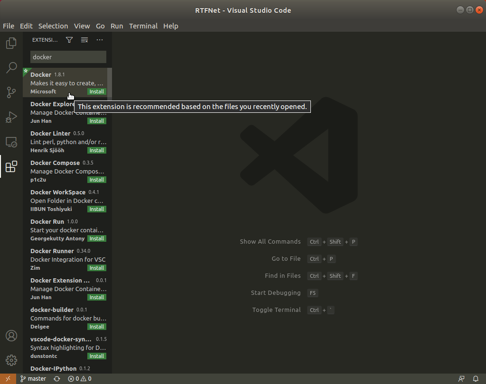
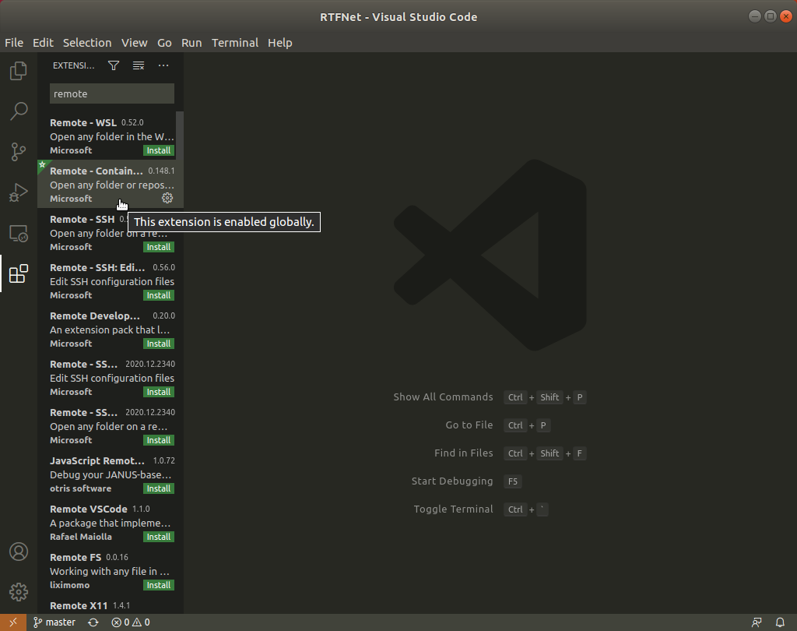

### Step 2: 
Click the left bottom square button, then follow the below figures.

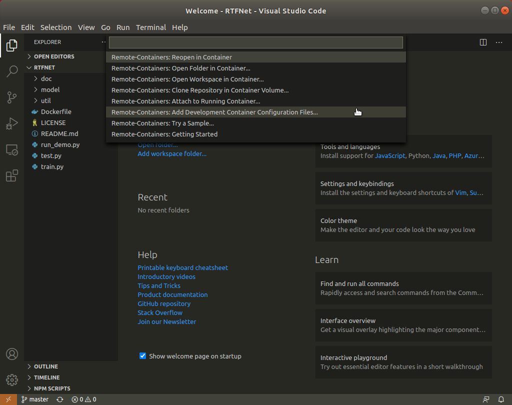
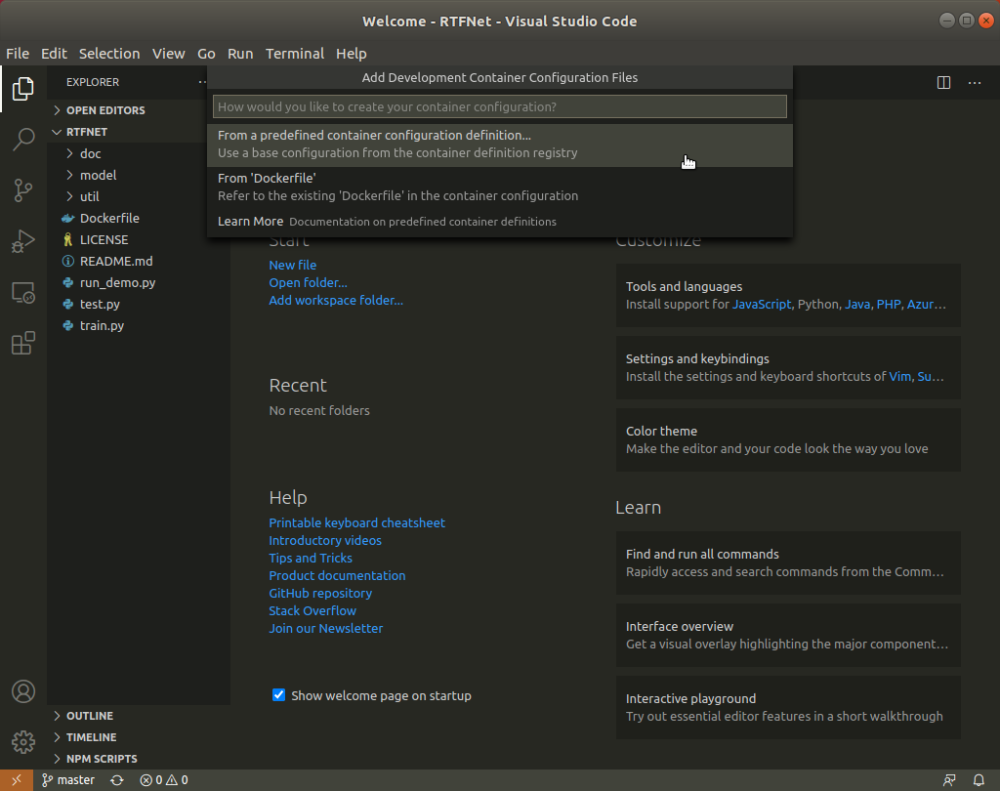
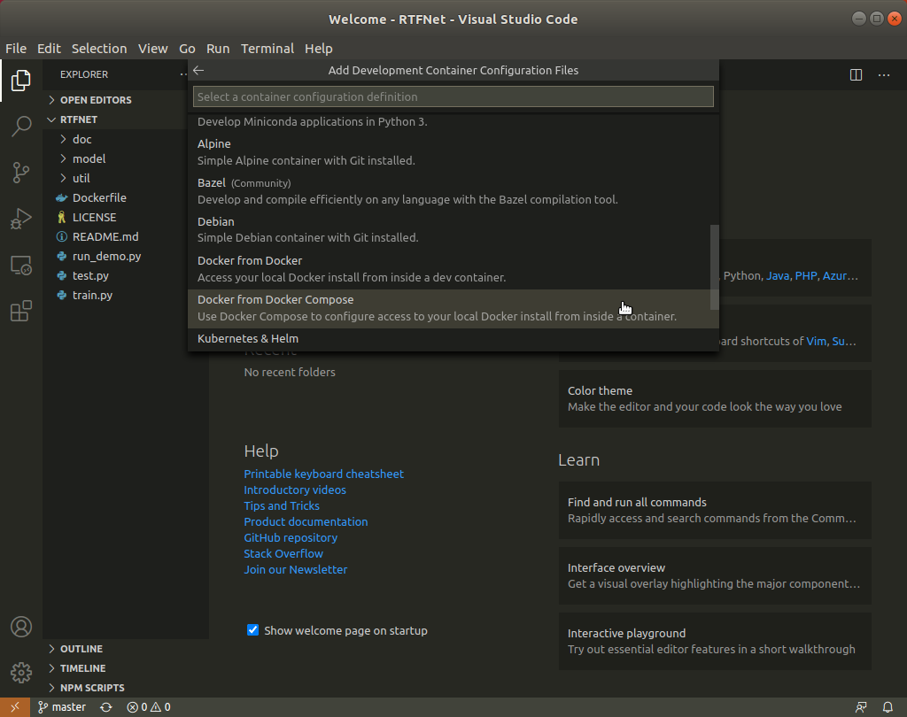

### Step 3: 
Overwrite the `devcontainer.json` and `docker-compose.yml` files using the ones given in this repo. Then delete the `Dockerfile`, because you have already built the docker image using a Dockerfile. You may need to add the volumn mapping to let docker container to access some folder in your local computer. Please also modify the devices list according to the number of your GPU cards.

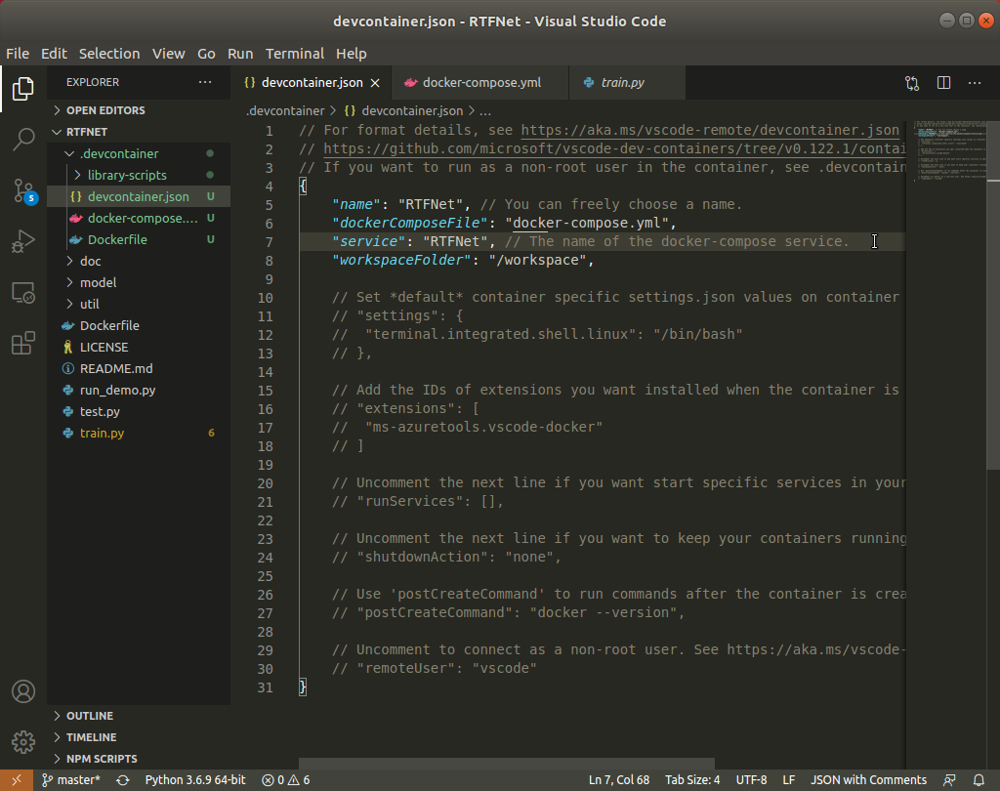
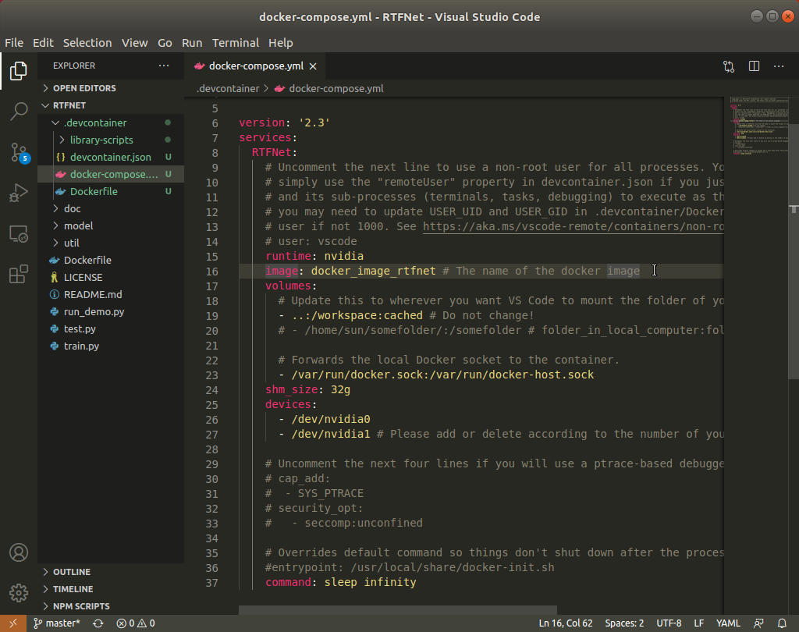
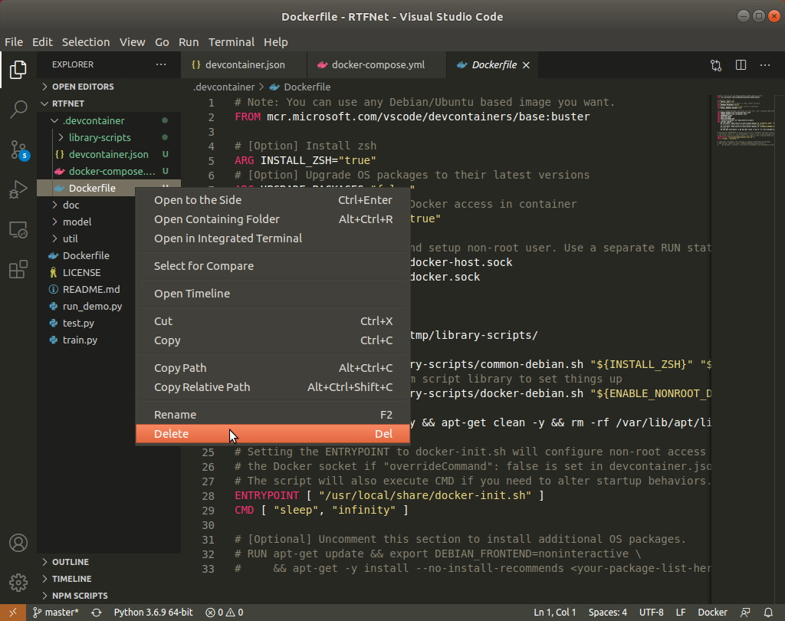

### Step 4: 
Click the left bottom square button again, then follow the below figures to reopen the project in a docker container that will be built by VSCode automatically. Then, the RTFNet folder will be automatically mounted on the `/workspace` folder in the container. 

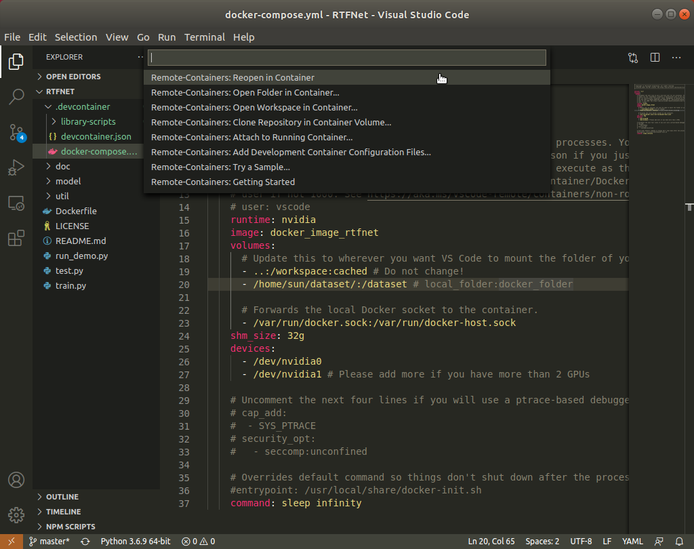

### Step-5: 
Finally, install the `Pylance` and `Python` extensions. The extensions will be installed in this container. If you do not install the two extensions, you may not be able to use code auto-completion, highlighting, etc. After that, you can write codes in the docker container using VSCode. You can run a program using command like `python3 test.py` in the VSCode TERMINAL, and terminate the program using `Ctrl+C`.

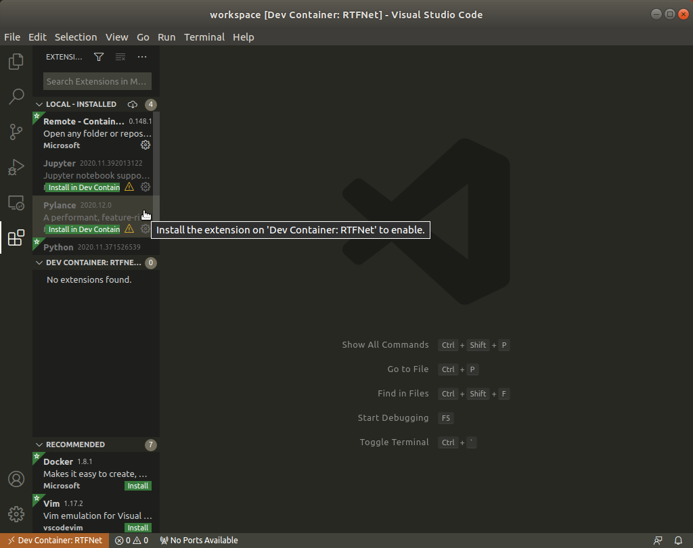
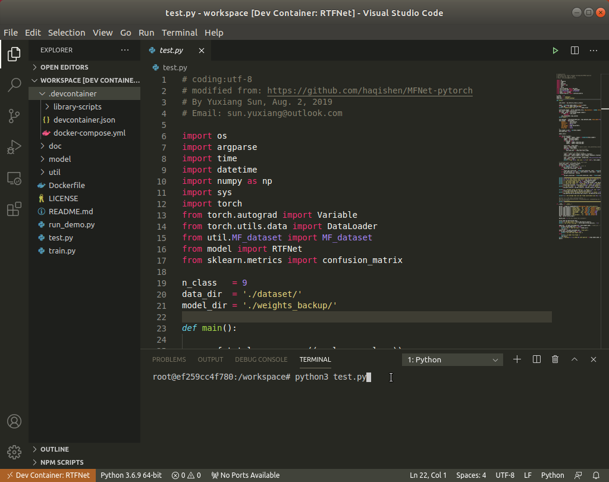

### Please feel free to contact me if you have any problems. 

sun.yuxiang@outlook.com, https://yuxiangsun.github.io/
